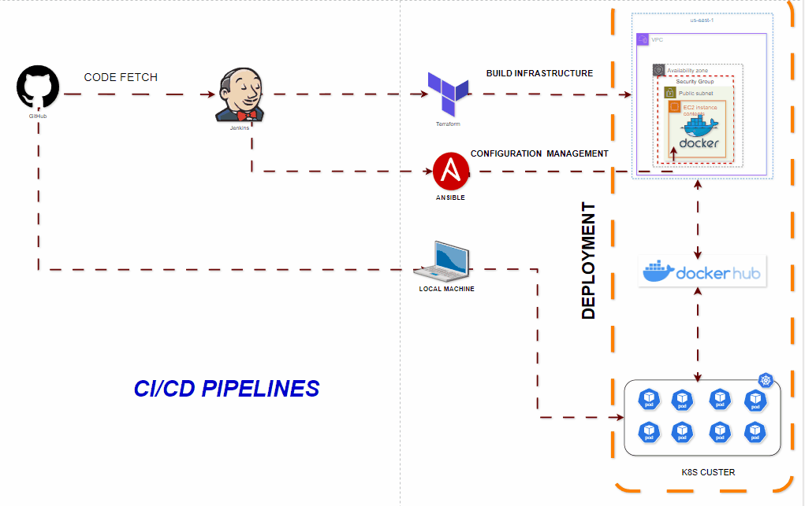

# **My CV Application - DevOps Project**


This project is a simple web application designed to demonstrate a complete DevOps pipeline that integrates tools such as **Git**, **Jenkins**, **Docker**, **Terraform**, **Ansible**, **AWS EC2**, and **Kubernetes (Minikube)**. The pipeline automates the deployment of the application and can be run both on AWS EC2 and locally with Kubernetes.

## **Project Architecture**

The project architecture demonstrates the full cycle of continuous integration and deployment, utilizing modern DevOps tools and methodologies.

---

## **Tools and Technologies Used**

- **Git**: Version control for source code.
- **Jenkins**: CI/CD automation for managing pipeline execution.
- **Docker**: Containerization of the application.
- **Docker Hub**: Centralized repository for Docker images.
- **Terraform**: Infrastructure as Code (IaC) tool for provisioning AWS resources.
- **Ansible**: Configuration management for setting up the environment on AWS EC2.
- **AWS EC2**: Hosting the application on a cloud-based virtual machine.
- **Kubernetes (Minikube)**: Local environment for deploying and testing the application in Kubernetes.

---

## **Pipeline Stages**

1. **Clone GitHub Repository**: Clones the project repository from GitHub.
2. **Check for Changes in GitHub**: Detects changes in the repository and skips unnecessary builds.
3. **Check if Docker Image Exists on Docker Hub**: Skips building if the Docker image is already up-to-date.
4. **Build Docker Image**: Builds the Docker image of the application if there are changes.
5. **Push Docker Image**: Pushes the built image to Docker Hub.
6. **Run Terraform to Provision EC2**: Uses Terraform to create an EC2 instance on AWS.
7. **Setup Environment on EC2 using Ansible**: Configures the EC2 instance with necessary packages and dependencies.

---

## **Steps to Set Up and Run the Pipeline**

### **Prerequisites**

Ensure the following are installed on your system:

- **Docker**
- **Jenkins** with required plugins (Git, Docker, Terraform, Ansible)
- **AWS Account** and set up credentials in Jenkins
- **Terraform** and **Ansible**
- **Minikube** for Kubernetes local setup (optional, for running locally)

### **Jenkins Pipeline Setup**

1. **Clone the GitHub Repository**:

    ```bash
    git clone https://github.com/Ahmed3019/my-cv-application.git
    cd my-cv-application
    ```

2. **Jenkins Setup**:
    - Add your AWS Access Key and Secret Key to Jenkins credentials.
    - Add your GitHub and Docker Hub credentials to Jenkins.

3. **Configure the Jenkinsfile**:

    The Jenkins pipeline consists of the following stages:
    - **Clone GitHub Repo**: Clones the project repository.
    - **Check for Changes in GitHub**: Skips the build if no changes are detected.
    - **Check if Docker Image Exists**: Skips the build and push if the image already exists.
    - **Build and Push Docker Image**: Builds the Docker image and pushes it to Docker Hub.
    - **Run Terraform**: Uses Terraform to provision the EC2 instance.
    - **Setup EC2 using Ansible**: Runs an Ansible playbook to set up the application environment on the EC2 instance.

4. **Run the Pipeline**:

    Execute the Jenkins pipeline. Ensure that each stage completes successfully.

---

## **Running the Application Locally with Kubernetes (Minikube)**

If you prefer to run the application locally using Kubernetes, follow these steps:

1. **Install Minikube**:

    Follow the official [Minikube Installation Guide](https://minikube.sigs.k8s.io/docs/start/) to install and set up Minikube.

2. **Start Minikube**:

    Run the following command to start Minikube with sufficient resources:

    ```bash
    minikube start --cpus=2 --memory=4096
    ```

3. **Deploy the Application to Kubernetes**:

    Ensure Minikube is running, then apply the Kubernetes configurations for the deployment and service:

    ```bash
    kubectl create namespace frontend-task
    kubectl apply -f deployment.yaml -n frontend-task
    kubectl apply -f service.yaml -n frontend-task
    ```

4. **Access the Application**:

    Retrieve the Minikube service URL:

    ```bash
    minikube service frontend-task --url -n frontend-task
    ```

    Use the URL to access your application.

---

## **Project File Structure**

```bash
my-cv-application/
│
├── code/
│   ├── templates/
│   │   └── index.html        # HTML file for the application
│   ├── static/
│   │   └── css/
│   │       └── styles.css     # CSS for styling the web application
│
├── Dockerfile                 # Dockerfile to build the application image
├── jenkinsfile                # Jenkins pipeline configuration
├── nx-key.pem                 # Key pair for AWS EC2 instance access
├── terraform/
│   ├── main.tf                # Terraform file for provisioning AWS EC2
│   ├── variables.tf           # Terraform variables configuration
│   ├── outputs.tf             # Terraform output for EC2 public IP
│
├── k8s/
│   ├── deployment.yaml        # Kubernetes Deployment manifest
│   └── service.yaml           # Kubernetes Service manifest
├── setup_environment.sh       # Script to set up EC2 instance
├── setup_environment.yaml     # Ansible playbook to automate setup on EC2
├── README.md                  # Project documentation (this file)
